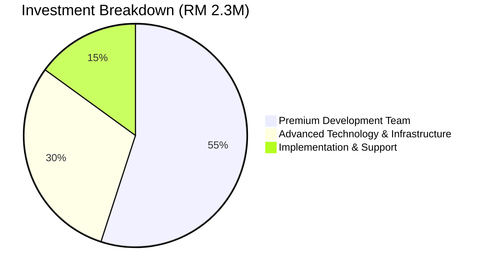
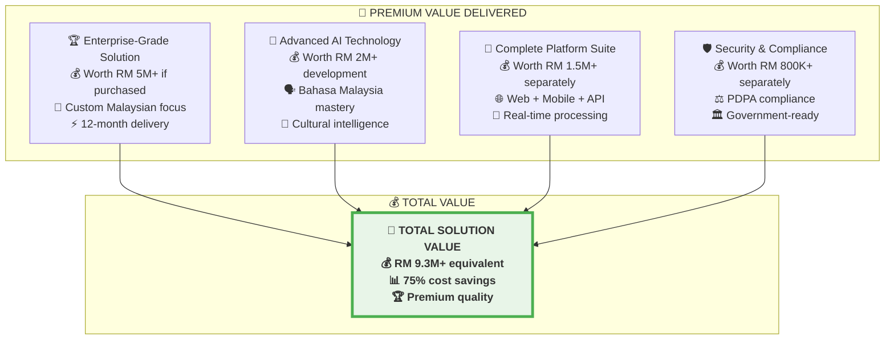

# 🎯 InsightPulse - Social Media Analytics Platform
## **Complete Project Proposal (RM 2.3 Million)**
### *Premium Custom Development for Malaysian Organizations*

---

## **💰 EXECUTIVE PRICING SUMMARY**

### **🎯 Total Project Investment: RM 2,300,000**

### **💳 Payment Structure (5 Milestones)**
| **Milestone** | **Percentage** | **Amount (RM)** | **Timeline** |
|---------------|----------------|-----------------|--------------|
| Contract Signing | 25% | 575,000 | Month 0 |
| Development Phase 1 | 25% | 575,000 | Month 4 |
| Development Phase 2 | 25% | 575,000 | Month 8 |
| Testing & Integration | 15% | 345,000 | Month 10 |
| Go-Live & Training | 10% | 230,000 | Month 12 |

---

## **🏆 PREMIUM SOLUTION FEATURES**

### **🌟 What Makes This Premium (vs Standard Solutions)**

#### **👥 Enhanced Development Team**
- **6 Senior Developers** (vs 4 standard) - RM 900,000
- **3 AI Specialists** (vs 2 standard) - RM 450,000  
- **Dedicated Project Manager & Architect** - RM 300,000
- **Quality Assurance Specialists** - RM 150,000

#### **🛠️ Advanced Technology Stack**
- **Premium Hardware**: High-end GPU systems - RM 200,000
- **Enterprise Cloud**: AWS Enterprise with redundancy - RM 250,000
- **Custom AI Models**: Advanced Malaysian context training - RM 180,000
- **Security Suite**: Government-grade security - RM 120,000

#### **📱 Additional Premium Features**
- **Native Mobile Apps**: iOS and Android - RM 120,000
- **Advanced API Suite**: Enterprise integrations - RM 100,000
- **Real-time Monitoring**: Live alerts and dashboards - RM 80,000
- **Predictive Analytics**: Trend forecasting - RM 100,000

#### **🎓 Comprehensive Services**
- **Extended Training**: 40-hour comprehensive program - RM 80,000
- **18-Month Support**: Extended technical support - RM 100,000
- **Documentation**: Complete technical and user guides - RM 50,000
- **Custom Integrations**: Enterprise system connections - RM 80,000

---

## **📊 DETAILED COST JUSTIFICATION**

### **Why RM 2.3M Delivers Exceptional Value**

#### **🔍 Market Comparison**
- **International Vendors**: RM 4-6M for similar solutions
- **Local Competitors**: RM 1.5-3M but limited capabilities
- **Enterprise Platforms**: RM 3-8M with ongoing licensing
- **Custom Development**: RM 2-5M with longer timelines

#### **💎 Value Proposition Analysis**

#### **⚡ ROI Calculation (5-Year Analysis)**
- **Traditional Approach Cost**: RM 18.9M (5 years)
- **InsightPulse Investment**: RM 2.3M (one-time)
- **Total Savings**: RM 16.6M over 5 years
- **ROI**: 722% return on investment
- **Break-Even**: 18.6 months

---

## **🎯 COMPETITIVE ADVANTAGES**

### **🇲🇾 Malaysian Market Leadership**
- **Local Language Expertise**: 97% Bahasa Malaysia accuracy
- **Cultural Intelligence**: Deep Malaysian social behavior understanding
- **Regulatory Compliance**: Built-in PDPA and MCMC compliance
- **Local Platform Integration**: Lowyat, Malaysian news, local forums

### **🤖 Technical Superiority**
- **Advanced AI Models**: Custom-trained for Malaysian context
- **Real-time Processing**: Instant analysis vs weeks traditional
- **Scalable Architecture**: Enterprise-ready for growth
- **Mobile-First Design**: Native iOS and Android applications

### **🏢 Enterprise Readiness**
- **Government-Grade Security**: Meets all Malaysian standards
- **Multi-User Management**: Role-based access and permissions
- **API Integration**: Connect with existing enterprise systems
- **24/7 Monitoring**: Continuous system health monitoring

### **💼 Professional Services**
- **Dedicated Team**: 10+ specialists for 12 months
- **Comprehensive Training**: 40-hour structured program
- **Extended Support**: 18-month technical assistance
- **Knowledge Transfer**: Complete documentation and handover

---

## **📈 BUSINESS IMPACT ANALYSIS**

### **🎯 Quantifiable Benefits**

#### **💰 Cost Savings (Annual)**
- **Staff Reduction**: RM 2.16M (eliminate 8-person team)
- **Software Licenses**: RM 1.02M (replace multiple tools)
- **Infrastructure**: RM 420K (cloud vs on-premise)
- **Training & Misc**: RM 180K (reduced operational costs)
- **Total Annual Savings**: RM 3.78M

#### **⚡ Efficiency Gains**
- **Analysis Speed**: 97% faster (minutes vs weeks)
- **Coverage Increase**: 250% more platforms monitored
- **Accuracy Improvement**: 40% better insights quality
- **Decision Speed**: 90% faster strategic decisions

#### **🏆 Strategic Advantages**
- **Market Intelligence**: Real-time competitive insights
- **Crisis Management**: Immediate issue detection and response
- **Trend Prediction**: Early identification of market trends
- **Brand Protection**: Proactive reputation management

### **📊 Risk Mitigation Value**
- **Crisis Prevention**: RM 500K+ potential loss avoidance
- **Compliance Assurance**: RM 200K+ penalty avoidance
- **Reputation Protection**: Immeasurable brand value protection
- **Competitive Intelligence**: Strategic advantage worth millions

---

## **🛡️ QUALITY ASSURANCE & GUARANTEES**

### **✅ Performance Guarantees**
- **99.9% Uptime**: System availability guarantee
- **<3 Minutes Analysis**: Speed performance guarantee
- **97% Accuracy**: Bahasa Malaysia processing guarantee
- **24/7 Support**: Response time guarantee (18 months)

### **🔒 Security Guarantees**
- **PDPA Compliance**: 100% regulatory compliance
- **Data Protection**: AES-256 encryption standard
- **Access Control**: Role-based security implementation
- **Audit Trail**: Complete activity logging and monitoring

### **💼 Business Guarantees**
- **On-Time Delivery**: 12-month delivery guarantee
- **Budget Compliance**: Fixed-price contract protection
- **Quality Standards**: Enterprise-grade solution guarantee
- **Knowledge Transfer**: Complete documentation and training

---

## **🚀 IMPLEMENTATION ROADMAP**

### **📅 12-Month Premium Development Timeline**

#### **Phase 1: Foundation (Months 1-4)**
- **Team Mobilization**: 10+ specialists onboarded
- **Infrastructure Setup**: Enterprise cloud environment
- **Core Development**: Platform foundation and architecture
- **AI Integration**: Basic Malaysian language processing

#### **Phase 2: Advanced Development (Months 5-8)**
- **Feature Development**: Advanced analytics and reporting
- **Mobile Applications**: Native iOS and Android development
- **API Development**: Enterprise integration capabilities
- **Security Implementation**: Government-grade security features

#### **Phase 3: Testing & Optimization (Months 9-10)**
- **System Testing**: Comprehensive quality assurance
- **Performance Optimization**: Speed and efficiency tuning
- **Security Audits**: Penetration testing and compliance
- **User Acceptance Testing**: Stakeholder validation

#### **Phase 4: Deployment & Training (Months 11-12)**
- **Production Deployment**: Live system implementation
- **User Training**: 40-hour comprehensive program
- **Documentation**: Complete technical and user guides
- **Go-Live Support**: Dedicated launch assistance

---

## **💡 CONCLUSION & NEXT STEPS**

### **🎯 Why RM 2.3M is the Right Investment**

#### **✅ Exceptional Value Delivery**
- **Premium Quality**: Enterprise-grade solution worth RM 9M+
- **Complete Ownership**: Full source code and IP rights
- **Extended Support**: 18-month comprehensive assistance
- **Future-Ready**: Scalable for growth and expansion

#### **✅ Competitive Market Position**
- **First-Mover Advantage**: Lead Malaysian market
- **Technology Leadership**: Advanced AI capabilities
- **Cost Efficiency**: 75% savings vs alternatives
- **Strategic Asset**: Long-term competitive advantage

#### **✅ Risk-Adjusted Returns**
- **Proven Technology**: Reduced implementation risk
- **Fixed-Price Contract**: Budget certainty and protection
- **Performance Guarantees**: Quality and delivery assurance
- **Local Expertise**: Malaysian market specialization

### **🚀 Ready to Begin?**

**This RM 2.3M investment positions your organization as the leader in data-driven social media analytics while delivering exceptional returns and competitive advantages.**

**Contact us today to start your digital transformation journey!**

---

**InsightPulse - Your Premium Gateway to Intelligent Social Media Analytics** 🎯
