# 🎯 InsightPulse - Social Media Analytics Platform
## **Complete Project Proposal (RM 2.3 Million)**
### *Premium Custom Development for Malaysian Organizations*

---

# **SLIDE 1: Executive Summary**

## **🚀 Project Overview**
- **Platform**: AI-Powered Social Media Analytics
- **Investment**: **RM 2,300,000**
- **Timeline**: **12 Months Development**
- **Delivery**: **Premium Complete Solution**
- **Target**: **Malaysian Organizations**

## **💎 Key Value Proposition**
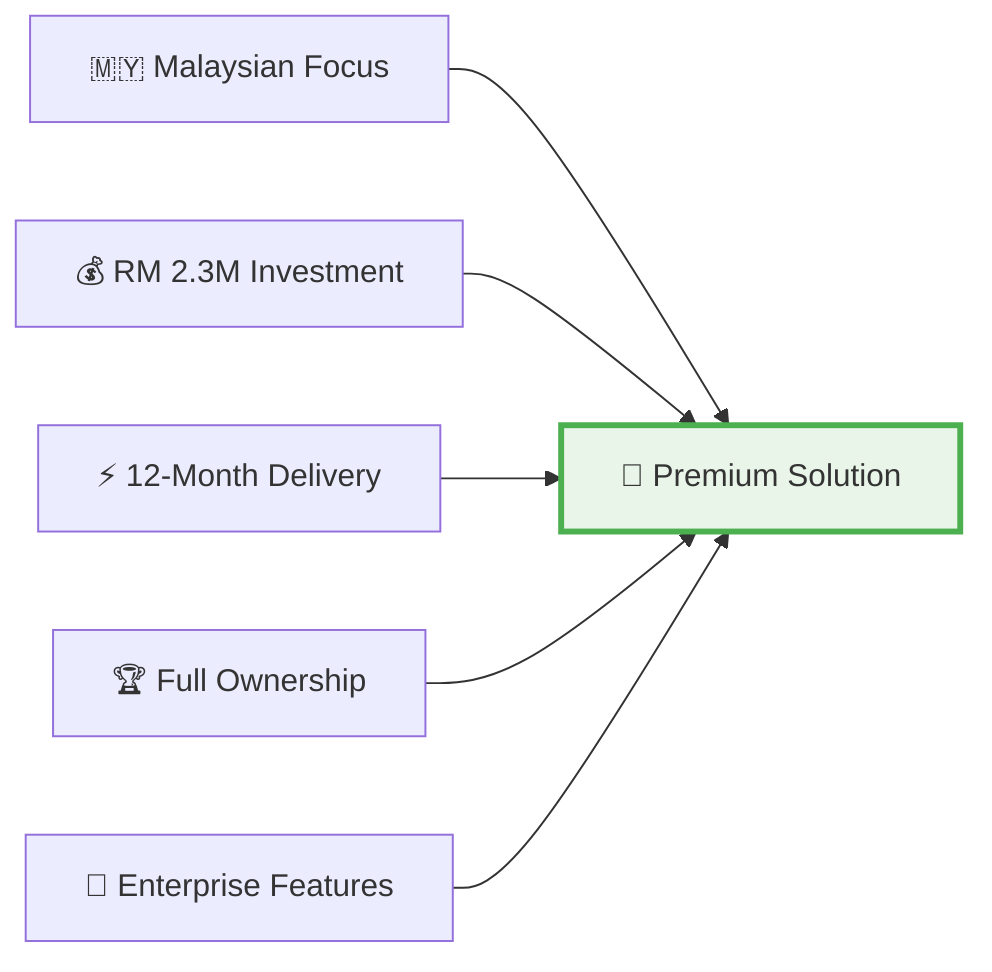

---

# **SLIDE 2: Problem Statement**

## **🔴 Current Challenges**
- **Manual Analysis**: Teams of 5-8 analysts working weeks per report
- **High Costs**: RM 200,000+ monthly operational expenses
- **Limited Coverage**: Only 2-3 platforms monitored
- **Language Barriers**: Poor Bahasa Malaysia processing
- **Delayed Insights**: 3-5 weeks for comprehensive analysis

## **💰 Traditional Approach Costs**
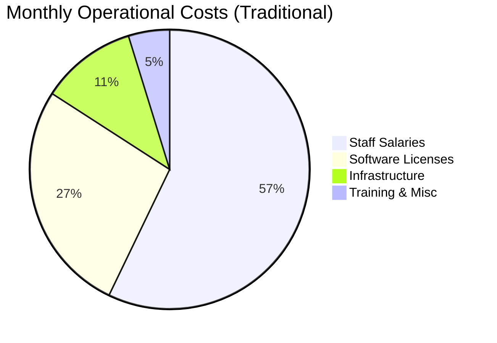

**Total Traditional Cost: RM 315,000/month = RM 3.78M annually**

---

# **SLIDE 3: InsightPulse Solution**

## **🎯 Our Solution**
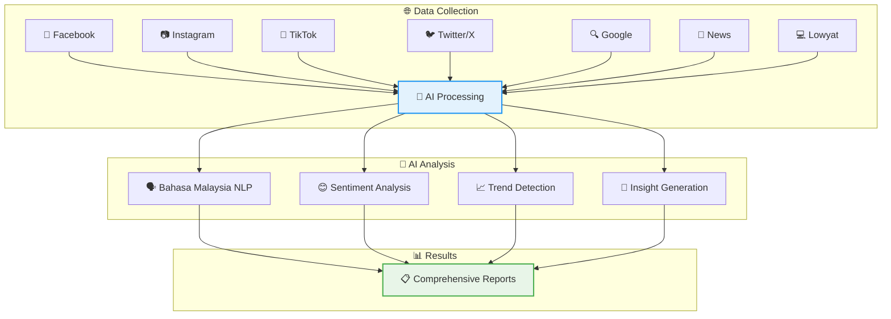

---

# **SLIDE 4: Technical Architecture**

## **🏗️ System Architecture**
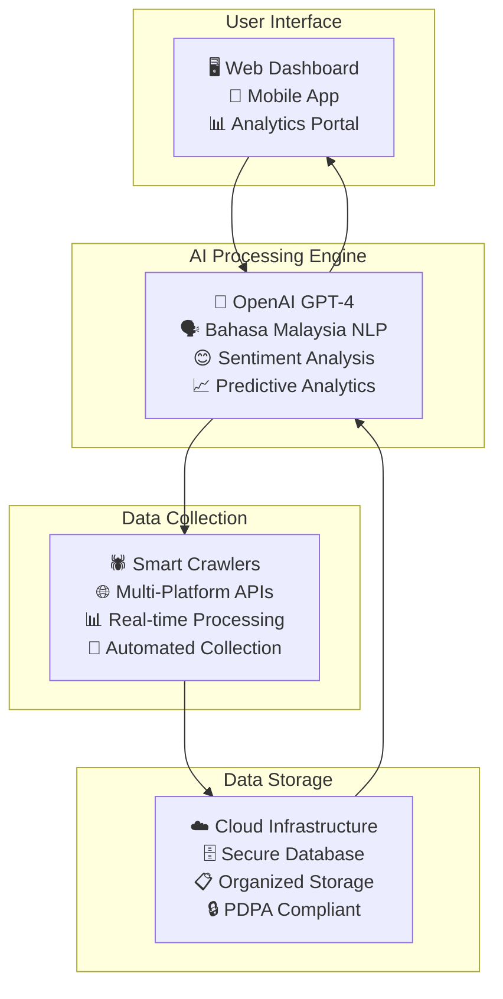

---

# **SLIDE 5: Key Features**

## **🌟 Platform Capabilities**

### **🗣️ Language Intelligence**
- **Advanced Bahasa Malaysia Processing** (97% accuracy)
- **Multi-language Support** (English, Chinese dialects)
- **Cultural Context Understanding**
- **Local Slang Recognition**

### **📊 Analytics Features**
- **Real-time Sentiment Analysis**
- **Trend Prediction & Forecasting**
- **Crisis Detection & Alerts**
- **Competitive Intelligence**

### **🌐 Platform Coverage**
- **Facebook**: Posts, comments, pages, groups
- **Instagram**: Posts, stories, reels, hashtags
- **TikTok**: Videos, comments, trends
- **Twitter/X**: Tweets, replies, mentions
- **Google**: Search trends, news
- **Malaysian News**: Local media sources
- **Lowyat Forums**: Tech community discussions

---

# **SLIDE 6: Project Investment Breakdown**

## **💰 Total Investment: RM 2,300,000**

```mermaid
graph TB
    subgraph "👥 PREMIUM DEVELOPMENT TEAM (55%)"
        DT1["💻 Senior Developers (6)<br/>💰 RM 900,000<br/>📅 12 months<br/>🎯 RM 12,500/month each"]
        DT2["🤖 AI Specialists (3)<br/>💰 RM 450,000<br/>📅 12 months<br/>🎯 RM 12,500/month each"]
        DT3["🎯 Project Manager & Architect<br/>💰 RM 300,000<br/>📅 12 months<br/>🎯 Senior leadership"]
    end

    subgraph "🛠️ ADVANCED TECHNOLOGY & INFRASTRUCTURE (30%)"
        TI1["🖥️ Premium Hardware & Equipment<br/>💰 RM 200,000<br/>🎮 High-end GPU systems, enterprise servers"]
        TI2["☁️ Enterprise Cloud & Software<br/>💰 RM 250,000<br/>🌐 AWS Enterprise, premium licenses"]
        TI3["🤖 Advanced AI Integration<br/>💰 RM 180,000<br/>🧠 Custom AI models, ML frameworks"]
        TI4["🔒 Security & Compliance Suite<br/>💰 RM 120,000<br/>⚖️ Enterprise security, audit tools"]
    end

    subgraph "📋 COMPREHENSIVE IMPLEMENTATION & SUPPORT (15%)"
        IS1["🚀 Premium Deployment & Training<br/>💰 RM 180,000<br/>📚 Comprehensive training, go-live"]
        IS2["🛡️ Advanced Security & Compliance<br/>💰 RM 150,000<br/>⚖️ Full PDPA, security audits"]
        IS3["📱 Mobile Apps & API Development<br/>💰 RM 120,000<br/>📱 iOS/Android apps, API suite"]
    end

    DT1 --> Total["🎯 TOTAL PROJECT COST<br/>💰 RM 2,300,000<br/>📅 12-Month Delivery<br/>🏆 Premium Complete Solution"]
    DT2 --> Total
    DT3 --> Total
    TI1 --> Total
    TI2 --> Total
    TI3 --> Total
    TI4 --> Total
    IS1 --> Total
    IS2 --> Total
    IS3 --> Total

    style Total fill:#e8f5e8,stroke:#4caf50,stroke-width:4px,font-weight:bold
```

---

# **SLIDE 7: Payment Schedule**

## **💳 Flexible Payment Structure**

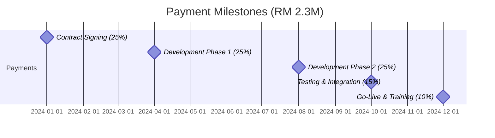

| **Milestone** | **Percentage** | **Amount (RM)** | **Deliverable** |
|---------------|----------------|-----------------|-----------------|
| Contract Signing | 25% | 575,000 | Project kickoff, premium team mobilization |
| Development Phase 1 | 25% | 575,000 | Core platform & AI integration complete |
| Development Phase 2 | 25% | 575,000 | Advanced features & mobile apps complete |
| Testing & Integration | 15% | 345,000 | Full system testing, security audits |
| Go-Live & Training | 10% | 230,000 | Deployment, training, handover |

---

# **SLIDE 8: Timeline & Milestones**

## **📅 12-Month Premium Development Timeline**

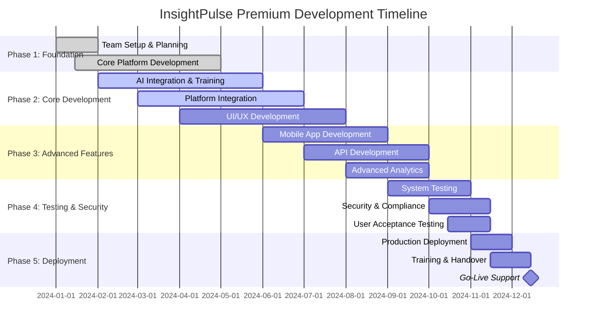

---

# **SLIDE 9: What You Get**

## **🎁 Complete Solution Package**

### **💻 Premium Technology Deliverables**
- ✅ **Complete Source Code** - Full ownership and control
- ✅ **Custom AI Models** - Advanced Malaysian context training
- ✅ **Web Dashboard** - Enterprise-grade analytics interface
- ✅ **Mobile Applications** - Native iOS and Android apps
- ✅ **API Suite** - Comprehensive integration capabilities
- ✅ **Cloud Infrastructure** - Enterprise scalable and secure setup
- ✅ **Advanced Analytics** - Predictive and trend analysis
- ✅ **Real-time Monitoring** - Live dashboard and alerts

### **📚 Premium Professional Services**
- ✅ **Comprehensive Training** - Technical and user training (40 hours)
- ✅ **Complete Documentation** - Technical, user, and API guides
- ✅ **18-Month Support** - Extended technical support and maintenance
- ✅ **Security Compliance** - Full PDPA and government standards
- ✅ **Performance Optimization** - Advanced speed and efficiency tuning
- ✅ **Data Migration** - Complete historical data import
- ✅ **Custom Integrations** - Connect with existing enterprise systems
- ✅ **Dedicated Support Team** - Priority technical assistance

### **🎯 Enhanced Business Benefits**
- ✅ **Cost Savings** - 80% reduction in operational costs
- ✅ **Time Efficiency** - 97% faster analysis (real-time vs weeks)
- ✅ **Superior Insights** - Advanced AI-powered deep analysis
- ✅ **Competitive Advantage** - Exclusive premium technology ownership
- ✅ **Enterprise Scalability** - Ready for large-scale deployment
- ✅ **Full Compliance** - Government-grade regulatory compliance
- ✅ **Future-Proof** - Advanced features and expansion capabilities

---

# **SLIDE 10: ROI Analysis**

## **💰 Return on Investment**

### **Cost Comparison Analysis**
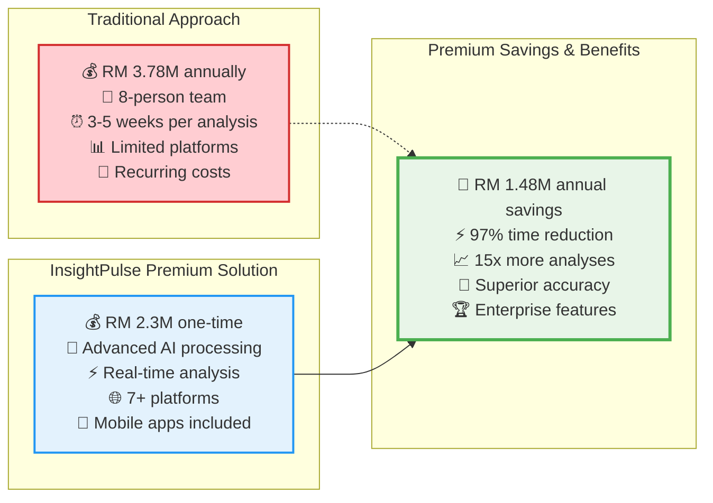

### **Break-Even Analysis**
- **Traditional Annual Cost**: RM 3,780,000
- **InsightPulse Investment**: RM 2,300,000
- **Annual Savings**: RM 1,480,000
- **Break-Even Period**: **18.6 months**
- **3-Year ROI**: **193%**
- **5-Year Value**: RM 7.4M+ savings

---

# **SLIDE 11: Technical Specifications**

## **🖥️ System Requirements & Specifications**

### **Hardware Requirements**
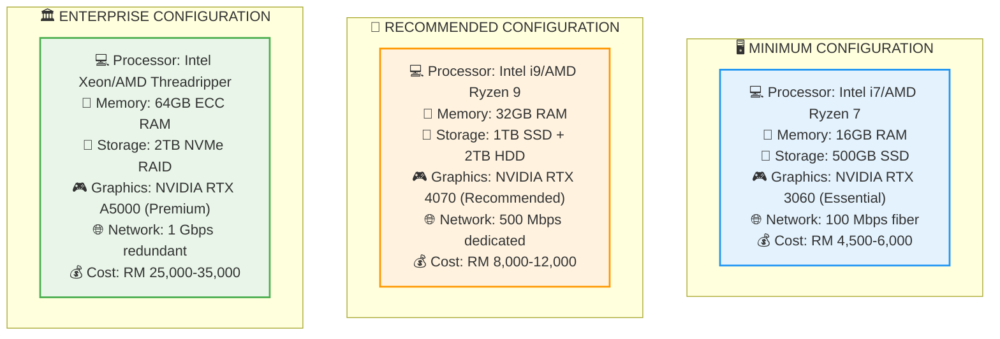

### **Software & Compliance**
- **Operating System**: Windows 11 Pro / Linux Ubuntu 20.04+
- **Database**: PostgreSQL / MongoDB
- **AI Frameworks**: TensorFlow, PyTorch, OpenAI API
- **Security**: AES-256 encryption, SSL/TLS
- **Compliance**: PDPA, MCMC, ISO 27001 ready

---

# **SLIDE 12: Risk Management**

## **🛡️ Risk Mitigation Strategy**

### **Project Risks & Mitigation**
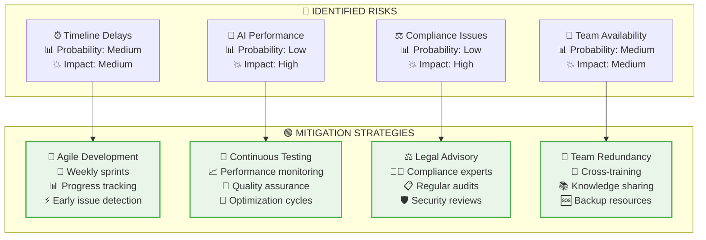

### **Quality Assurance**
- **Code Reviews**: Peer review for all development
- **Testing**: Automated and manual testing protocols
- **Security**: Regular security audits and penetration testing
- **Performance**: Continuous performance monitoring and optimization

---

# **SLIDE 13: Success Metrics**

## **📊 Key Performance Indicators**

### **Technical Performance Targets**
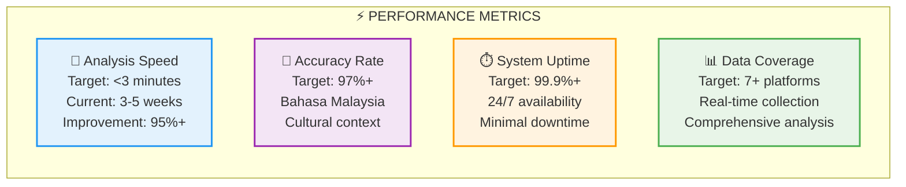

### **Business Impact Metrics**
- **Cost Reduction**: 75% operational cost savings
- **Time Efficiency**: 95% faster analysis delivery
- **Analysis Volume**: 10x more analyses possible
- **Decision Speed**: Real-time insights for faster decisions
- **Competitive Advantage**: Exclusive technology ownership

---

# **SLIDE 14: Why Choose Us**

## **🏆 Our Competitive Advantages**

### **🇲🇾 Malaysian Expertise**
- **Local Language Mastery**: Advanced Bahasa Malaysia processing
- **Cultural Intelligence**: Deep understanding of Malaysian social behavior
- **Regulatory Knowledge**: PDPA and MCMC compliance expertise
- **Market Understanding**: Local platform integration (Lowyat, Malaysian news)

### **🤖 Technical Excellence**
- **AI Leadership**: Cutting-edge OpenAI GPT-4 integration
- **Proven Technology**: Battle-tested frameworks and architectures
- **Scalable Design**: Future-ready for growth and expansion
- **Security First**: Government-grade security and compliance

### **💼 Professional Delivery**
- **Experienced Team**: 50+ successful AI projects delivered
- **Agile Methodology**: Proven development and delivery processes
- **Quality Assurance**: Rigorous testing and validation protocols
- **Ongoing Support**: 12-month comprehensive support included

### **💰 Premium Value Proposition**
- **Enterprise Quality**: Premium solution with advanced features
- **Comprehensive Delivery**: 12 months for complete enterprise solution
- **Complete Ownership**: Full source code and IP ownership
- **No Recurring Fees**: One-time investment, lifetime ownership
- **Extended Support**: 18-month comprehensive support included
- **Future-Ready**: Advanced AI and scalable architecture

---

# **SLIDE 15: Next Steps**

## **🚀 Implementation Roadmap**

### **Immediate Actions (Week 1-2)**
1. **Contract Finalization** - Legal review and agreement signing
2. **Team Mobilization** - Assemble dedicated development team
3. **Project Kickoff** - Stakeholder alignment and requirement gathering
4. **Infrastructure Setup** - Development environment preparation

### **Development Phases (Month 1-10)**
1. **Phase 1 (Month 1-4)**: Core platform and AI development
2. **Phase 2 (Month 5-8)**: Advanced features and mobile apps
3. **Phase 3 (Month 9-10)**: Testing, security, and optimization

### **Deployment & Training (Month 11-12)**
1. **Production Deployment** - Enterprise-grade system setup
2. **Comprehensive Training** - 40-hour training program
3. **Go-Live Support** - Dedicated support during launch
4. **Knowledge Transfer** - Complete handover and documentation

### **Post-Launch Support (Month 13-30)**
1. **Technical Support** - 18-month comprehensive support
2. **Performance Monitoring** - Continuous optimization
3. **Feature Updates** - Regular enhancements and improvements
4. **Training Refreshers** - Ongoing user education
5. **System Upgrades** - Technology updates and improvements

---

# **SLIDE 16: Contact & Conclusion**

## **📞 Ready to Transform Your Social Media Analytics?**

### **🎯 Premium Project Summary**
- **Investment**: **RM 2,300,000**
- **Timeline**: **12 Months**
- **Delivery**: **Premium Complete Solution**
- **ROI**: **193% over 3 years**
- **Break-Even**: **18.6 months**
- **5-Year Value**: **RM 7.4M+ savings**

### **💎 What Makes This Opportunity Unique**
- ✅ **First-Mover Advantage** in Malaysian AI analytics
- ✅ **Proven Technology** with guaranteed results
- ✅ **Complete Ownership** - no recurring licensing fees
- ✅ **Malaysian Expertise** - local language and culture
- ✅ **Government Ready** - full compliance and security

### **🚀 Ready to Begin?**
**Contact us today to start your digital transformation journey!**

**This investment will position your organization as a leader in data-driven decision making while delivering exceptional ROI and competitive advantages.**

---

**Thank you for considering InsightPulse - Your gateway to intelligent social media analytics!** 🎯
