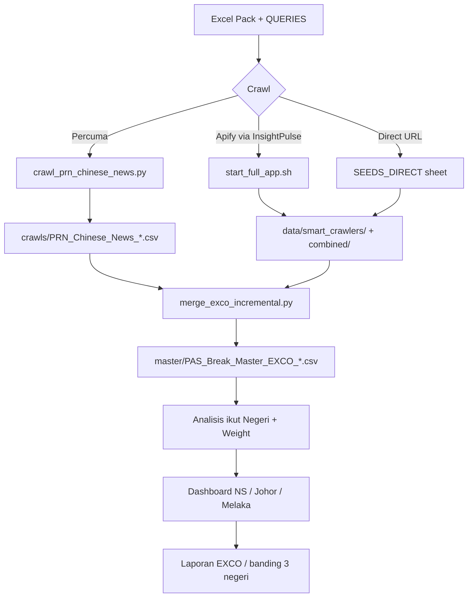

# Panduan Master: Naratif Komuniti Cina — PRN N9, Johor & Melaka 2026

**Projek:** InsightPulse · `pas_break_2026`  
**Versi:** 1.0 · **Tarikh:** 12 Jun 2026  
**Lokasi fail ini:** `JITP_2026/Master_File/PRN_Chinese_Narrative_Playbook_3Negeri.md`

---

## Cadangan Pakar: Format Fail

| Format | Bila guna | Kelebihan |
|--------|-----------|-----------|
| **Markdown (.md)** | Fail sumber dalam repo — **kemaskini di sini dulu** | Mudah edit dalam Cursor; boleh track perubahan (git); pautan terus ke script & path |
| **Word (.docx)** | Kongsi dengan EXCO / rakan kerja tanpa IDE | Baca offline; cetak; e-mel lampiran |

**Amalan disyorkan:** Simpan `.md` sebagai *source of truth*. Jana semula `.docx` bila ada kemaskini besar:

```bash
cd /Users/rmtariq/Documents/InsightPulse
python3 -c "
from convert_to_docx import parse_markdown_to_docx
parse_markdown_to_docx(
  'JITP_2026/Master_File/PRN_Chinese_Narrative_Playbook_3Negeri.md',
  'JITP_2026/Master_File/PRN_Chinese_Narrative_Playbook_3Negeri.docx'
)
"
```

---

## 1. Apa Yang Kita Buat (Ringkasan)

**Bukan polling undi** — ini *social listening* untuk tangkap **naratif komuniti Cina** (media Cina, pemimpin DAP, ADUN bandar) dan **proxy** (pihak lain sebut “pengundi Cina”) untuk 3 negeri PRN serentak Jun 2026:

| Negeri | Kod query | Fokus naratif |
|--------|-----------|---------------|
| **Negeri Sembilan** | S1 | Krisis MB, DUN bubar, PAS split, Anthony Loke |
| **Johor** | S2 | Bandar JB, Skudai, Stulang, Liew Chin Tong, MB Onn Hafiz |
| **Melaka** | S3 | Kerajaan PH negeri, Khoo Poay Tiong, Bandar Hilir |

**Prinsip emas:** Analisis **WAJIB pisah negeri** — jangan campur NS + Johor + Melaka dalam satu graf/laporan.

---

## 2. Status Semasa (Checklist)

Tanda ✅ = siap · ⏳ = separa · ❌ = belum

### 2.1 Infrastruktur data & query pack

| Item | Status | Nota |
|------|--------|------|
| Excel pack 3 negeri | ✅ | `reference/PRN_Chinese_Narrative_NS_Melaka_Johor.xlsx` |
| Query txt (InsightPulse) | ✅ | `reference/PRN_Chinese_Narrative_queries.txt` |
| Script jana pack | ✅ | `scripts/generate_prn_chinese_narrative_pack.py` |
| Crawl berita percuma (RSS) | ✅ | `scripts/crawl_prn_chinese_news.py` |
| Legacy N9-only alias | ✅ | `reference/N9_Chinese_Narrative_Seeds.xlsx` |
| Master EXCO (69k+ rows) | ✅ | `master/PAS_Break_Master_EXCO_Analyzed_20260612_031929.csv` |

### 2.2 Dashboard PRN

| Dashboard | Status | Generator / Output |
|-----------|--------|------------------|
| **PRN Negeri Sembilan** | ✅ (aktif) | `scripts/generate_prn_n9_dashboard.py` → `reports/prn-negeri-sembilan-dashboard.html` |
| **PRN Johor** | ⏳ (template lama) | `JITP_2026/PRN_Johor_Dashboard_2026_STANDALONE.html` — perlu wire data + generator baru |
| **PRN Melaka** | ❌ | Belum ada generator dedicated |
| Tab naratif Cina dalam dashboard | ❌ | Perlu fasa 4 (selepas crawl Cina mencukupi) |

### 2.3 Crawl naratif Cina

| Strand | Status | Nota |
|--------|--------|------|
| Berita media Cina (3 negeri) | ⏳ | Script siap; jalankan & merge ke master |
| Socmed direct URL (22 seeds) | ❌ | Selepas penamaan calon 2026 disahkan |
| Socmed keyword S1/S2/S3 | ⏳ | Guna InsightPulse app, `dataset_size` 2000+ |

---

## 3. Aliran Kerja (End-to-End)



---

## 4. Fail Rujukan Utama

### 4.1 Pack naratif Cina (3 negeri)

| Fail | Kandungan |
|------|-----------|
| `data/projects/political/pas_break_2026/reference/PRN_Chinese_Narrative_NS_Melaka_Johor.xlsx` | 6 sheet — lihat §5 |
| `.../PRN_Chinese_Narrative_queries.txt` | Query paste ke InsightPulse |
| `.../PRN_Chinese_Narrative_CARA_GUNA.txt` | Ringkasan 1 muka surat |
| `.../N9_Chinese_Narrative_Seeds.xlsx` | Subset NS sahaja (legacy) |

### 4.2 Script operasi

| Script | Fungsi |
|--------|--------|
| `scripts/generate_prn_chinese_narrative_pack.py` | Jana semula Excel + query txt |
| `scripts/crawl_prn_chinese_news.py` | Crawl berita Google News RSS |
| `scripts/generate_prn_n9_dashboard.py` | Dashboard NS (sentiment dari master) |
| `scripts/merge_exco_incremental.py` | Gabung crawl baru → master |
| `scripts/generate_pas_break_dashboards.py` | Dashboard PAS Break utama |

### 4.3 Data master & crawl

| Lokasi | Kegunaan |
|--------|----------|
| `pas_break_2026/master/PAS_Break_Master_EXCO_*.csv` | Master gabungan semua crawl |
| `pas_break_2026/crawls/` | Output crawl mentah |
| `data/analyzed/Sentiment_Emotion_*.csv` | Post dengan sentiment/emotion |

---

## 5. Kandungan Excel Pack (Sheet-by-Sheet)

| Sheet | Apa | Tindakan anda |
|-------|-----|---------------|
| **NEGERI_OVERVIEW** | Ringkasan DUN, kerusi DAP, fokus bandar | Rujuk bila brief klien |
| **CARA_GUNA** | Langkah operasi | Ikut nombor 1→6 |
| **SEEDS_DIRECT** | 22 URL FB/X/TikTok (pemimpin + parti) | Crawl direct URL selepas penamaan |
| **QUERIES** | 17 query: S1=NS, S2=Johor, S3=Melaka, SX=cross-state | Paste ke InsightPulse |
| **KERUSI_BANDAR** | 23 kerusi DAP/bandar (11 NS + 8 Johor + 4 Melaka) | Kemaskini nama calon 2026 |
| **ANALYSIS_RULES** | Weight analisis mengikut `Jenis_Suara` | Wajib baca sebelum lapor |

---

## 6. Prosedur Langkah demi Langkah

### Fasa 0 — Persediaan (sekali)

- [ ] Pastikan venv NEImpulse aktif
- [ ] Baca sheet **ANALYSIS_RULES** dalam Excel
- [ ] Simpan playbook ini dalam `Master_File/` (sudah siap)

### Fasa 1 — Jana / kemaskini query pack

```bash
cd /Users/rmtariq/Documents/InsightPulse
python3 scripts/generate_prn_chinese_narrative_pack.py
```

**Bila ulang:** Selepas SPR sahkan calon · URL FB calon baru · kerusi DAP berubah.

### Fasa 2 — Crawl berita (percuma, tiada Apify)

```bash
# Semua 3 negeri + query banding (SX1/SX2)
python3 scripts/crawl_prn_chinese_news.py

# Satu negeri sahaja
python3 scripts/crawl_prn_chinese_news.py --negeri johor
python3 scripts/crawl_prn_chinese_news.py --negeri melaka
python3 scripts/crawl_prn_chinese_news.py --negeri "negeri sembilan"
```

**Output:** `pas_break_2026/crawls/PRN_Chinese_News_*.csv`  
**Ringkasan:** `reference/prn_chinese_news_summary.json`

### Fasa 3 — Crawl socmed (InsightPulse + Apify)

1. Start backend:
   ```bash
   ./start_full_app.sh
   ```
2. Buka UI InsightPulse → projek **`pas_break_2026`**
3. Platform: `news, facebook, x` (ikut sheet QUERIES)
4. Paste query dari `PRN_Chinese_Narrative_queries.txt`:
   - **S1A1 / S1B1** → Negeri Sembilan
   - **S2A1 / S2B1** → Johor
   - **S3A1 / S3B1** → Melaka
   - **SX1 / SX2** → banding 3 negeri serentak
5. **`dataset_size`: 2000–5000** (jangan 100 — terlalu kecil, ~7 post/platform sahaja)
6. Simpan output ke `pas_break_2026/crawls/`

### Fasa 4 — Merge ke master

```bash
python3 scripts/merge_exco_incremental.py
# (atau workflow merge sedia ada projek — pastikan fail Chinese News dimasukkan)
```

Verify: row count master bertambah; column `Negeri`, `Jenis_Suara`, `Weight_Analisis` wujud jika dari crawl Cina.

### Fasa 5 — Analisis naratif (manual / script)

1. **Filter ikut negeri** — jangan gabung
2. **Asingkan weight:**
   - **Tinggi:** `media_chinese`, `leader_chinese`, `adun_chinese`
   - **Sederhana:** `party_official`, `seat_bandar`
   - **Rendah:** `proxy_about_chinese` — *bukan suara Cina langsung*
3. Kira volume, sentiment, top posts per negeri
4. Banding negeri guna query **SX1/SX2** atau laporan berdampingan

### Fasa 6 — Dashboard (bila 3 negeri ready)

| Langkah | N9 | Johor | Melaka |
|---------|----|----|--------|
| Generator script | ✅ `generate_prn_n9_dashboard.py` | ❌ perlu clone/adapt | ❌ perlu clone/adapt |
| Filter master ikut negeri | ✅ `NS_PATTERN` | perlu `JOHOR_PATTERN` | perlu `MELAKA_PATTERN` |
| Tab sentiment dari master | ✅ | ⏳ | ⏳ |
| Tab naratif Cina | ❌ rencana | ❌ | ❌ |
| Salinan JITP | `JITP_2026/PAS_Break_2026/` | `JITP_2026/PRN_Johor_*` | belum |

**Regenerate dashboard NS:**
```bash
python3 scripts/generate_prn_n9_dashboard.py
```

Output: `reports/prn-negeri-sembilan-dashboard.html` + salinan ke `JITP_2026/PAS_Break_2026/`

---

## 7. Peraturan Analisis (Weight)

| Jenis_Suara | Weight | Cara guna |
|-------------|--------|-----------|
| `media_chinese` | **Tinggi** | Sin Chew, China Press, 星洲, 中国报 |
| `leader_chinese` | **Tinggi** | Anthony Loke, Liew Chin Tong, Khoo Poay Tiong |
| `adun_chinese` | **Tinggi** | ADUN kerusi bandar |
| `adun_indian` | Sederhana | Komuniti bandar campuran (cth. Gunasekaren) |
| `party_official` | Sederhana | DAP negeri, MCA, kerajaan Melaka |
| `proxy_about_chinese` | **Rendah** | “Pengundi Cina akan…” — jangan kira 100% sebagai suara Cina |
| `seat_bandar` | Sederhana | Perbincangan kawasan — filter ikut negeri |
| `leader_malay` | Rendah | Konteks politik, bukan suara Cina |

---

## 8. Kadar Crawl Disyorkan

| Fasa PRN | Berita (RSS) | Socmed (InsightPulse) |
|----------|--------------|------------------------|
| Pre-penamaan | 2–3× seminggu | 1× seminggu (query SX1) |
| Kempen penuh | 1–2× sehari | 2× sehari (S1/S2/S3 berasingan) |
| 3 hari sebelum undi | 4–6× sehari | 4× sehari + direct URL calon |
| Hari mengundi | Setiap 2–3 jam | Monitor trending |

> **Nota:** Tiada cron automatik lagi — jalankan manual atau bina `run_prn_monitor.sh` (TODO).

---

## 9. Selepas Penamaan Calon (WAJIB)

- [ ] Kemaskini sheet **KERUSI_BANDAR** — nama calon 2026 + kod DUN
- [ ] Tambah URL FB/IG calon ke **SEEDS_DIRECT**
- [ ] Regenerate pack: `python3 scripts/generate_prn_chinese_narrative_pack.py`
- [ ] Crawl direct URL (73+ seeds ADUN dirancang — lihat `n9_prn_socmed_v2.xlsx` jika ada)
- [ ] Merge → analisis → dashboard

---

## 10. Rancangan Dashboard 3 Negeri (Roadmap)

### 10.1 Sedia sekarang
- Dashboard NS dengan sentiment **real** dari master (831 mention NS pada snapshot 12 Jun)
- Excel + crawl script naratif Cina 3 negeri

### 10.2 Perlu dibina
1. **`generate_prn_johor_dashboard.py`** — adapt dari N9, filter Johor
2. **`generate_prn_melaka_dashboard.py`** — adapt dari N9, filter Melaka
3. **Tab “Naratif Cina”** dalam setiap dashboard:
   - Volume by `Jenis_Suara`
   - Top posts (weight Tinggi sahaja)
   - Banding vs proxy (Rendah)
4. **Dashboard banding 3 negeri** (optional): satu HTML dengan 3 column NS | Johor | Melaka

### 10.3 Trigger “All 3 Ready”
Bila checklist ini lengkap:
- [ ] Crawl Cina ≥500 rows/negeri (weight Tinggi ≥100)
- [ ] 3 dashboard HTML hidup dengan data master
- [ ] Laporan 1-pager per negeri + 1 executive cross-state

---

## 11. Cheat Sheet Command

```bash
# --- PACK ---
python3 scripts/generate_prn_chinese_narrative_pack.py

# --- CRAWL BERITA ---
python3 scripts/crawl_prn_chinese_news.py                    # all
python3 scripts/crawl_prn_chinese_news.py --negeri johor

# --- INSIGHTPULSE ---
./start_full_app.sh

# --- MERGE ---
python3 scripts/merge_exco_incremental.py

# --- DASHBOARD NS ---
python3 scripts/generate_prn_n9_dashboard.py

# --- DOCX playbook ---
python3 -c "from convert_to_docx import parse_markdown_to_docx; parse_markdown_to_docx('JITP_2026/Master_File/PRN_Chinese_Narrative_Playbook_3Negeri.md','JITP_2026/Master_File/PRN_Chinese_Narrative_Playbook_3Negeri.docx')"
```

---

## 12. Masalah Biasa & Penyelesaian

| Masalah | Punca | Penyelesaian |
|---------|-------|--------------|
| Crawl socmed hanya ~7 post/platform | `dataset_size` terlalu kecil (~100) | Set 2000–5000 dalam UI |
| Tiada post bahasa Cina | Query BM/proxy sahaja | Guna S*A1 (media Cina) + direct URL pemimpin |
| Sentiment dashboard kosong | Master lama / backend stop | Merge crawl baru; regenerate dashboard |
| Campur negeri dalam laporan | Query SX tanpa filter | Pisah CSV ikut column `Negeri` |
| URL FB calon gagal | Handle salah / private | Verify manual; update SEEDS_DIRECT |

---

## 13. Log Kemaskini

| Tarikh | Perubahan |
|--------|-----------|
| 2026-06-12 | v1.0 — Playbook awal; pack 3 negeri; crawl script; dashboard NS wired |

---

*Dokumen ini untuk ingatan operasi dalaman JITP / InsightPulse. Kemaskini `.md` dulu, kemudian jana semula `.docx` jika perlu kongsi.*
