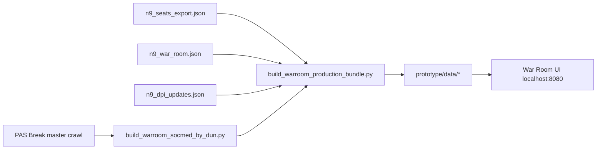

# PRN War Room — Real Dashboard (N9)

War Room prototype (`prototype/index.html`) now runs on **production data** for Negeri Sembilan — same sources as `prn-negeri-sembilan-dashboard.html`.

## Quick start

```bash
bash scripts/start_prn_warroom_prototype.sh
# → http://localhost:8080
```

Startup auto-runs `build_warroom_production_bundle.py`.

## What is real vs mock

| Module | N9 | Johor / Melaka |
|--------|-----|----------------|
| Command Center KPI | ✅ Master crawl + seats | Mock |
| Coalition bars | ✅ Rule-based dari kerusi + senario | Mock |
| Issue heatmap | ✅ Keyword crawl NS (24j window) | Mock |
| Intel Gabungan | ✅ War room + socmed + cula | Partial |
| DUN Drill-Down | ✅ 36 kerusi + DPI + geo | Geo mock |
| Culaan Digital | ✅ Live API + CSV | ✅ Live API |
| Naratif Cina/India | Mock actions | Mock |

## Data pipeline



## Refresh after data update

```bash
# Full production HTML (all tabs)
python3 scripts/generate_prn_n9_dashboard.py

# War room prototype bundle only
python3 scripts/build_warroom_production_bundle.py
python3 scripts/build_warroom_socmed_by_dun.py   # if crawl changed

# Regenerate war room playbook
python3 scripts/n9_war_room.py
```

## Files written to prototype/data/

| File | Content |
|------|---------|
| `warroom_dun_N9_production.json` | 36 DUN merged export + geo + socmed |
| `war_room_intel_N9.json` | Hari ini + socmed signals |
| `n9_social_summary.json` | Command Center KPIs |
| `socmed_by_dun_N9.json` | Mention per kerusi |
| `n9_production_bundle.json` | Manifest + metadata |

## Relationship to full dashboard

| | War Room (prototype) | prn-negeri-sembilan-dashboard.html |
|--|----------------------|--------------------------------------|
| UX | 7 modul operasi | 10+ tab analitik penuh |
| Fokus | Command + DUN + Cula + Narrative | Scenario engine, sentiment deep-dive |
| Data | Same N9 sources | Same + embedded charts |

Both can coexist: War Room for **daily ops**, full dashboard for **deep analysis**.
